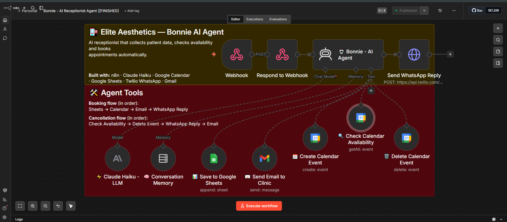

# Bonnie — AI Receptionist for Aesthetic & Dental Clinics

> Conversational AI agent that handles appointment booking, availability checking, and cancellations via WhatsApp — fully automated, 24/7.

🌐 **Live demo:** [myelon-ai.vercel.app](https://myelon-ai.vercel.app)

---
## 🧠 Workflow



## 🎬 Demo

[▶ Watch Bonnie in action](https://drive.google.com/file/d/1afrxWIYF_DZQlu_N0IMNc0C1NtFt8ZOV/view?usp=sharing)
---

## 💡 What Bonnie does

- Greets patients and collects name, procedure, phone, and preferred date
- Checks Google Calendar availability in real time before confirming
- Books the appointment: saves to Google Sheets, creates calendar event, sends email to clinic and WhatsApp confirmation to patient
- Handles cancellations: finds the event, deletes it, notifies patient and clinic
- Responds in the patient's language (Spanish, Galician, English)

---

## 🏗️ Architecture

```
Patient (WhatsApp)
        ↓
   n8n AI Agent (Bonnie)
        ↓
┌───────────────────────────────┐
│  Check Availability           │ → Google Calendar
│  Save Lead                    │ → Google Sheets
│  Create/Delete Calendar Event │ → Google Calendar
│  Send Email to Clinic         │ → Gmail
│  Send WhatsApp Confirmation   │ → Twilio
└───────────────────────────────┘
```

---

## 🛠️ Tech Stack

| Layer | Tool |
|---|---|
| Automation | n8n (self-hosted) |
| AI / LLM | Claude Haiku (Anthropic API) |
| Messaging | Twilio WhatsApp |
| Calendar | Google Calendar API |
| CRM | Google Sheets |
| Email | Gmail API |
| Landing Page | HTML + Vercel |

---

## 🎯 Use Case

Built for aesthetic and dental clinics in the Spanish-speaking market. Bonnie replaces the manual receptionist for routine scheduling tasks, operating 24/7 without human intervention.

**Workflow repo:** [github.com/1thai8/bonnie-agent](https://github.com/1thai8/bonnie-agent)

---

## 📦 Related Projects

| Project | Description |
|---|---|
| [ai-lead-classifier-n8n](https://github.com/1thai8/ai-lead-classifier-n8n) | Lead scoring and routing with LLM |
| [ai-lead-capture-system](https://github.com/1thai8/ai-lead-capture-system) | Lead capture pipeline with AI outreach |

---

Built by [Thainá Souza](https://github.com/1thai8) · Myelon AI
